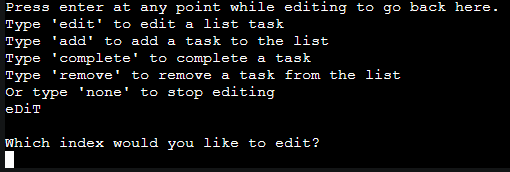
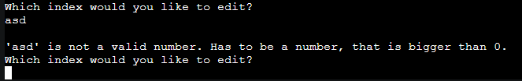
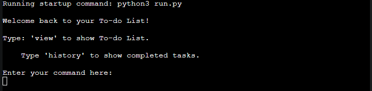

# To-do List
This program functions as a to-do list which the user may manipulate as they see fit. It's stored in an external google sheet so it is mostly limited to personal use as of now.

[Live link](https://felteng-to-do-list-fc4edcc70d21.herokuapp.com/) to the application.

## Table of contents
- [The goal](#the-goal)
    - [Goal of the developer](#goal-of-the-developer)
    - [Goal of the user](#goal-of-the-user)

- [User experience](#user-experience)
    - [User stories](#user-stories)

- [Features and planning](#features-and-planning)
    - [Logic planning](#logic-planning)
    - [Current features](#current-features)
    - [Future features](#future-features)

- [Technologies used](#technologies-used)
    - [Languages](#languages)
    - [Framework and libraries](#frameworks-and-libraries)
    - [Development and deployment](#development-and-deployment)

- [Testing](#testing)
    - [Test cases](#test-cases)
    - [Bugs](#bugs)

- [Deployment](#deployment)
    - [Live deployment](#live-deployment)
    - [Local](#local-deployment)

- [Credits](#credits)
    - [Technical](#technical)
    - [Community recognition](#community-recognition)

## The goal

### Goal of the developer
- ***Create a user-friendly experience through simplicity.***
    - Utilize simplicity to provide an easy to understand application despite the users experience level.

- ***Develop functionalities essential to a to-do list.***
    - Identify core functions necessary to manipulate a to-do list, such as adding new tasks and deadlines, updating a task and or deadline, removing redundant tasks, marking tasks as complete, and of course displaying the tasks.

- ***Provide a bug-free user experience.***
    - Implement functions to validate any input the user is expected to make to avoid bugs when displaying the table of tasks. It also helps the user avoid trying to manipulate a task that does not exist. Any wrongful input will also provide feedback to the user.

- ***Make data provided persist through sessions.***
    - Integrate google drive and google sheets through the use of an API to provide a source for the data to be stored, so that the user can maintain the to-do list across different sessions and even devices.

- ***Personal development and application of new skills.***
    - Take advantage of this project as means to learn more about Python, programming libraries, the use of APIs, common programming practices, as well as improving my problem solving skills.

### Goal of the user
- ***Manage and track everyday tasks.***
    - Get a scope of important day to day tasks all in one place to avoid stressful situations where a task or deadline gets lost track of.

- ***Look back through time.***
    - Have the ability to look back in history to see what adn when tasks have been accomplished.

- ***Relish a convenient experience.***
    - Avoid being plagued by bugs and technical difficulties while using the application, and get meaningful feedback when necessary.

[Back to the top](#to-do-list)
## User experience

### User stories
- As a first-time visitor:
    - I want to find an application that can help me organize my everyday tasks and provide som structure.

    - I want to be able to quickly get an understanding of the application I'm interacting with through a display simple and concise information.

    - I want to explore and utilize a program without being plagued by bugs and or techincal errors preventing me from understanding the program.

- As a returning visitor:
    - I want to quickly be able to access the information I've stored within this application as a daily routine.

    - I want to have the ability to easily manipulate the information and my task schedule.

    - I want to able to look back through 'time' and see what tasks I've accomplished.

    - I want my data to persist so that I can access it from anywhere on any device.

[Back to the top](#to-do-list)
## Features and planning

### Logic planning

### Current features
- **Choose your list**
    - Start by choosing to either view the 'tasks' on to-do list, or to view the 'history' of completed tasks. \
    

- **The to-do list 'tasks'**
    - This option will display all the tasks yet to completed or removed on the to-do list, with their indices and respective deadlines. With an option to edit. \
    

- **The 'history' of completed tasks**
    - This option will display a table of all the tasks that have been marked as completed, with an added column of when it was completed. With an option to edit. \
    

- **Editing the to-do list of tasks**
    - After choosing to edit the to-do list and the user will be presented with different editing options. \
    

- **Edit a task on the list**
    - Choosing 'edit' will let the user pick an index to edit, followed by what should be edited on the chosen index. \
    

- **Add a task to the list**
    - When adding a task to the list the user gets to provide a description of the task followed by a deadline for the task. \
    

- **Complete task from the list**
    - Marking a task as complete from the list will move it to the 'history' sheet with all the completed tasks, along with the date the task was completed. \
    

- **Removing a task from the list**
    - If the user wishes to remove a redundant task from the list that is easily doable. All it takes is for the user to provide the index to remove and to confirm that that index is correct. \
    

- **Editing the 'history' of completed tasks**
    - After choosing to edit the history list and the user will be able to remove a a 'completed' task in case it was accidentally completed. \
    

- **Removing a completed task**
    - If the user wishes to remove a completed task from the history list that is easily doable. Simply pick the relevant index and confirm it is correct. \
    

- **Input validation**
    - All user input runs through different validation processes to ensure that values have been given, and that the correct values have been given. If there's an error with the input the user will be made aware for the next attempt.

### Future features
- One obivous flaw in terms of appealing to a broad user base, or any user base at all is the fact that the whole to-do list is stored and managed around 1 spreadsheet file on my google account.
    - To improve upon this a solid future feature would be to implement user unique registration and login to allow for a large user base to share the same program but not have to share the same storage.

- Something I came to realize towards the end of the time window for this project is that the terminal could use some color on whatever is printed to convey more meaning to things like user errors for example.
    - To implement this I would suggest looking for a Python package on [PyPi](https://pypi.org/) with feature to change terminal line colors.

[Back to the top](#to-do-list)

## Technologies used

### Languages
- [Python](https://www.python.org/)

### Frameworks and libraries
- [Google Cloud](https://console.cloud.google.com/) - Setting up API connections.

- [gspread](https://pypi.org/project/gspread/) - Manipulation of the spreadsheet holding the task information.

- [PrettyTable](https://pypi.org/project/prettytable/) - Printing a comprehenisive table to the terminal.

- [OAuth2](https://pypi.org/project/oauth2/) - Authenticating credentials for API.

- [Flake8](https://flake8.pycqa.org/en/latest/) - In IDE PEP-8 linter.

- [CI Python Linter](https://pep8ci.herokuapp.com/#) - External PEP-8 linter for live adjustments.

### Development and deployment
- [Git](https://git-scm.com/) - Version control system.

- [GitHub](https://github.com/) - Hosting and storing Git repository.

- [Gitpod](https://www.gitpod.io/) - IDE for writing all the code.

- [Heroku](https://www.heroku.com/) - For deploying the program to live platform.

[Back to the top](#to-do-list)

## Testing
### Test cases
- Start the program.
    - Expected output: See a short welcome message followed by 2 options.
    - Actual output: \
    

- Give faulty input.
    - Expected output: Get feedback of bad input.
    - Actual output: \
    

- Enter 'tasks' with any letter casing.
    - Expected output: See the to-do list with current tasks, with edit option below.
    - Actual output: \
    

- Enter 'history' with any letter casing.
    - Expected output: See the history list of completed tasks, with edit option below.
    - Actual output: \
    

- Give faulty input on the edit the list option.
    - Expected output: Get feedback of bad input.
    - Actual output: \
    

- Type 'n', or 'no', with any letter casing on the edit list option.
    - Expected output: Get taken back to the initial 2 options.
    - Actual output: \
    

- Type 'y', or 'yes', with any letter casing on the edit list option.
    - Expected output: See the relevant editing options depending on which list was chosen before. 
    - Actual output: \
    
    

- Give input that is not listed above on what to edit.
    - Expected output: Get feedback of bad input.
    - Actual output: \
    

- Enter 'edit' with any letter casing.
    - Expected output: Get prompted to input a task index to edit.
    - Actual output: \
    

- Enter an index from the list above.
    - Expected output: Get asked to edit 'task', 'deadline', or 'both'.
    - Actual output: \
    

- Enter 'task' with any letter casing.
    - Expected output: Get asked to enter a task description that is shorter than 40 characters.
    - Actual output: \
    

- Enter 'deadline' with any letter casing.
    - Expected output: Get asked to enter a deadline in yyyy-mm-dd format.
    - Actual output: \
    

- Enter 'both' with any letter casing. 
    - Expected output: Get asked to enter a task description, and after that to enter a deadline.
    - Actual output: \
    

- Fullfil any of the editing options.
    - Expected output: See the updated list with the editing options below again.
    - Actual output: \
    

- Enter 'add' with any letter casing.
    - Expected output: Get asked to enter a task description.
    - Actual output: \
    
    
- Enter a description longer than 40 characters.
    - Expected output: Get notified that the description has been cut down and continue to deadline.
    - Actual output: \
    
    
- Enter a deadline.
    - Expected output: See the new task on the updated list with editing options below.
    - Actual output: \
    
    
- Enter a task description shorter than 40 characters and a deadline.
    - Expected output: See the task added with the same descrition that was given.
    - Actual output: \
    
    
- Enter 'complete' with any letter casing.
    - Expected output: Get asked which index to complete.
    - Actual output: \
    
    
- Enter a valid index to complete.
    - Expected output: Get asked for confirmation if the index chosen is correct.
    - Actual output: \
    
    
- Enter 'n' or just press enter.
    - Expected output: Get sent back to editing choices.
    - Actual output: \
    
    
- Repeat complete process but for index 3 and choose 'y'.
    - Expected output: Get notified task is being completed and see the active task list updated with the editing options below. The completed task can now be found in the 'history' list.
    - Actual output: \
    
    
- Enter 'remove' with any letter casing.
    - Expected output: Get asked which index to remove.
    - Actual output: \
    
    
- Enter a valid index from the list above.
    - Expected output: Get asked for confirmation if the index chosen is correct.
    - Actual output: \
    
    
- Enter 'y' or 'yes' with any letter casing to confirm removal.
    - Expected output: Task removed and update shown with editing options below
    - Actual output: \
    
    
- Enter 'none' with any letter casing.
    - Expected output: Get taken back to the 2 list choices.
    - Actual output: \
    
    
- Enter 'history' and then enter 'y' or 'yes' with any letter casing.
    - Expected output: See the options avaiable for editing the history list.
    - Actual output: \
    

- Enter 'remove' with any letter casing and go through the same process as removing an item from the to-do list to remove index 7.
    - Expected output: Task 7 removed and list updated to the user with editing options below.
    - Actual output: \
    
    
- Enter 'none' with any letter casing.
    - Expected output: Get taken back to the 2 list choices.
    - Actual output: \
    

- Press enter with no input when asked to choose, 'task', 'deadline', or 'both' when editing a task.
    - Expected output: 
    - Actual output: \
    

- Press enter with no input when adding a task description for any editing option.
    - Expected output: Get taken back to the editing options for the list chosen.
    - Actual output: \
    
    
- Press enter with no input when setting a deadline.
    - Expected output: Get taken back to the editing options for the list chosen.
    - Actual output: \
    
    
- Enter a deadline that does not match the format yyyy-mm-dd.
    - Expected output: Get feedback that the input is not in line with the format.
    - Actual output: \
    
    
- Enter a deadline with correct format of a date that has already passed.
    - Expected output: 
    - Actual output: \
    

- Press enter with no input when asked to select an index for any editing option.
    - Expected output: Get taken back to the editing options for the list chosen.
    - Actual output: \
    

- Enter an index not on the list while editing.
    - Expected output: Get feedback that the chosen index has no data.
    - Actual output: \
    

- Enter an index that is not a number.
    - Expected output: Get feedback that the index should be a number that is larger than 0.
    - Actual output: \
    

- Enter a number that is < 1.
    - Expected output: Get feedback that the index should be a number that is larger than 0.
    - Actual output: \
    

- Enter a number that is larger than amount of rows in the worksheet.
    - Expected output: Get feedback that the index chosen has no data.
    - Actual output: \
    
    
### Bugs

#### Solved bugs
- Unintended spacing when printing the initial options on program start. \

    - Found out that this wad due to the format the code line was split to abide PEP-8. \
    
        - This was solved by adopting a different method of splitting the line. \
        

- APIError raised when index input is larger than number of rows in sheet.
    - Missing a handler for such an input.
        - Implemented a way of handling it into the validate_content_presence function.
        

#### Unsolved bugs
- None aware of at the time of 2024-04-29.

[Back to the top](#to-do-list)

## Deployment

### Live deployment
The project was deployed to [Heroku](https://felteng-to-do-list-fc4edcc70d21.herokuapp.com/).

After creating my account at Heroku I took the following steps to ensure successful deployment:

1. At the start page/dashboard click 'New' in the top right part of the page to open a small dropdown.

2. In the dropdown select 'Create new app'.

3. Give the application a unique name and choose a region for deployment. I went with Europe since that's the closest for this applications purposes.

4. Click 'Create app'.

5. Back on the dashboard, select the newly created app.

6. On the app page click 'Settings'.

7. We want to set some Config Vars. Since the application utilizes an API to connect with the google spreadsheet, Heroku needs the credentials from the creds.json file.

8. Create a config var with key 'CREDS' and for the value, paste ALL of the content in the creds.json.

9. The second config var we need to set is key 'PORT' with value '8000'.

10. Now to add 2 neccessary buildpacks, IN THE ORDER SPECIFIED, click add buildpack and choose heroku/python. Then to do the same but choose heroku/nodejs.

Now to prepare the project itself for deployment on Heroku we need to make sure Heroku knows what dependencies to install to run the project.

11. Make sure there's a file called 'requirements.txt' in the root directory.

12. Type 'pip freeze > requirements. txt' in the terminal and you should see some information added to the requirements.txt file.

Make sure to push these changes to your repository before deploying.

13. Back on the app page on Heroku select 'Deploy', choose GitHub as deployment method and connect your account.

14. Search upp the name of the repository for the app to select it.

15. Deploy manually by choosing a branch to deploy from and click 'Deploy Branch'.

16. I also enabled automatic deploys for whenever a push is made to 'main' branch. This is however optional.

### Local deployment

1. Open a terminal in the workspace.

2. To exectute the program from the file it's written in type:
    - python3 name_of_file.py ("run.py" in this projects case).

[Back to the top](#to-do-list)

## Credits

### Technical
- [Google Cloud](https://console.cloud.google.com/) - Google Cloud is a cloud based storage service where you can tie your program together with Google's infrastructure. This saw its biggest use in this project by making use of Google Cloud APIs to connect the spreadsheet that holds the application content. Introduction to this  was made for me in Code Institues love sandwiches walkthrough project.

- [gspread](https://pypi.org/project/gspread/) - "gspread is a Python API for Google Sheets". It has been a vital tool for manipulating the data relevant to this application. Introduction to this  was made for me in Code Institues love sandwiches walkthrough project.

- [PrettyTable](https://pypi.org/project/prettytable/) - "A simple Python library for easily displaying tabular data in a visually appealing ASCII table format". The need for a tool such as PrettyTable was identified early on as I knew I was going to need to display the relevant information in a comprehenisve way and PrettyTable seemed like the best option, even though there were plenty of others.

- [OAuth2](https://pypi.org/project/oauth2/) - Used for authenticating credentials for the google drive API.

- [CI Python Linter](https://pep8ci.herokuapp.com/#) - Huge thanks to Code Institute once again for this amazing tool. This tool was utilized fully in the later stages of the project to ensure the code is up to PEP-8 standards.

- The global variable code for the API integration was embraced from Code Institute love_sandwiches walkthrough project.

### Community recognition

- My menntor Rohit Sharma for his advice throughout the project.

- [W3schools](https://www.w3schools.com/python) for their extensive breakdown of various coding concepts.

- My peers over at the [Code Institute Slack Community](https://code-institute-room.slack.com/) for their advice, feedback, and experience.

- [Stack Overflow](https://stackoverflow.com/) for their very large archive of forum posts with community members offering valuable insight regarding many different programming concepts.

[Back to the top](#to-do-list)